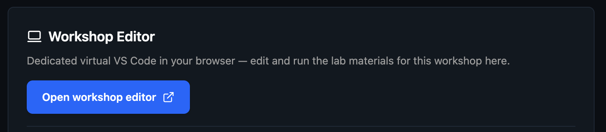
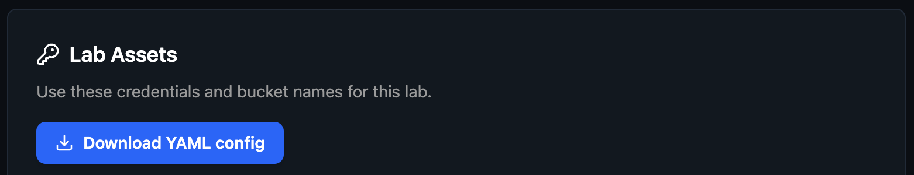

# MLOps Workshop Lab Guide — NYC, May 11, 2026

**VAST DataEngine** — serverless functions, S3 event triggers, LLM/VLM integration, VastDB, and video semantic search (VSS).

## What You'll Build

A video semantic search pipeline on VAST DataEngine — from raw `.mp4` upload to natural language query results:

- **Labs 1-3:** Deploy a serverless function, connect it to S3 events, and call an LLM
- **Labs 4-5:** Segment uploaded videos, extract frames, generate descriptions and embeddings, store in VastDB
- **(Bonus) Lab 6:** Query VastDB with a natural language prompt and return ranked video segments

## Schedule

| Lab | Title |
|-----|-------|
| [Lab Setup](#verify-setup) | Set up lab environment |
| [Lab 1](labs/lab1-hello-world/) | Hello Vast Data |
| [Lab 2](labs/lab2-s3-connect/) | Connect to S3 |
| [Lab 3](labs/lab3-llm-connect/) | Read from S3 + LLM Summarize |
| [Lab 4](labs/lab4-video-ingest/) | Video Ingest |
| [Lab 5](labs/lab5-video-embeddings/) | VLM + VastDB |
| [Lab 6](labs/lab6-video-search/) | Search Video |
| [Feedback](https://forms.gle/vwGigUtyxkvw9ZRUA) | Workshop Feedback |

## What You'll Learn

1. Write and deploy a DataEngine serverless function (init/handler model)
2. Connect a function to S3 event triggers using CloudEvents
3. Call external LLM APIs from a DataEngine function with secret management
4. Build a video ingestion pipeline (segment → embed → reason)
5. Write structured data to VastDB from a pipeline function
6. Expose a semantic video search endpoint via FastAPI

## Prerequisites

- Python (intermediate)
- Basic S3/object storage concepts
- Familiarity with REST APIs and API keys
- No prior DataEngine experience required

> **The lab environment is provided** — no local installs required. All tools (`vastde` CLI, Docker, Python 3.10+) are pre-configured on your workshop VM.

## Reach out for Help
We'll be right by if you need help!

Also [join our Community](https://community.vastdata.com/c/workshop) and give a quick intro (tag `intro`) and share any questions you have (tag `help`).

## Verify Setup
> All commands run on the **workshop VM** via the terminal in your browser. Nothing runs on your laptop.

1. Load the workshop environment in your browser

Click `Open workshop editor` to deploy the code editor in the browser:



2. Open the terminal and run the following commands to ensure everything is connected:

```sh
vastde --version #returns a value, so its defined
vastde version v5.5.0-2144029
```

```sh
vastde functions list # call is successful, `No functions available` returned
No functions available
```

3. Let's check other connections to ensure everything else is working
```sh
  s3cmd ls # lists all available buckets
```

4. Re-create the `$USER-mlops-config.yaml` file in the root of `/mlops-workshop-nyc-2026`:



> The file will download to your local machine, so can be dropped into the coding editor manually (at the root level).

5. Run the setup script to configure all labs with your credentials.

```sh
python3 setup.py
```

This generates `config.yaml`, `secrets.yaml`, and `.env` for each lab, writes a root `.env` with `DE_REG_HOST`, `DE_REG_USER`, `DE_REG_NAME`, and `USER`, and replaces `$USER` with your username in all pipeline configs. If the files already exist, they will not be overwritten.

Then load the environment variables into your shell:

```sh
source .env
```

> Note that you will need to run this command `source .env` for each terminal you use for pushing function images

6. Verify the registry variables are set before running any `docker` or `vastde` commands:

```sh
env | grep DE_REG
```

## Resources

- [Event page](https://luma.com/h8muplvs)
- [Join the VAST Community](https://community.vastdata.com/c/workshop)
- [Build on Vast: Resources for Builders](https://www.vastdata.com/platform/developers)
