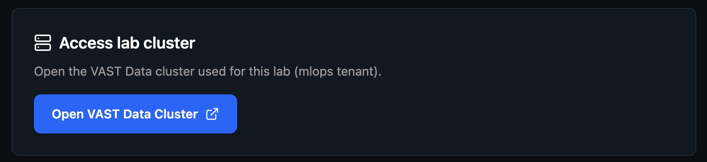
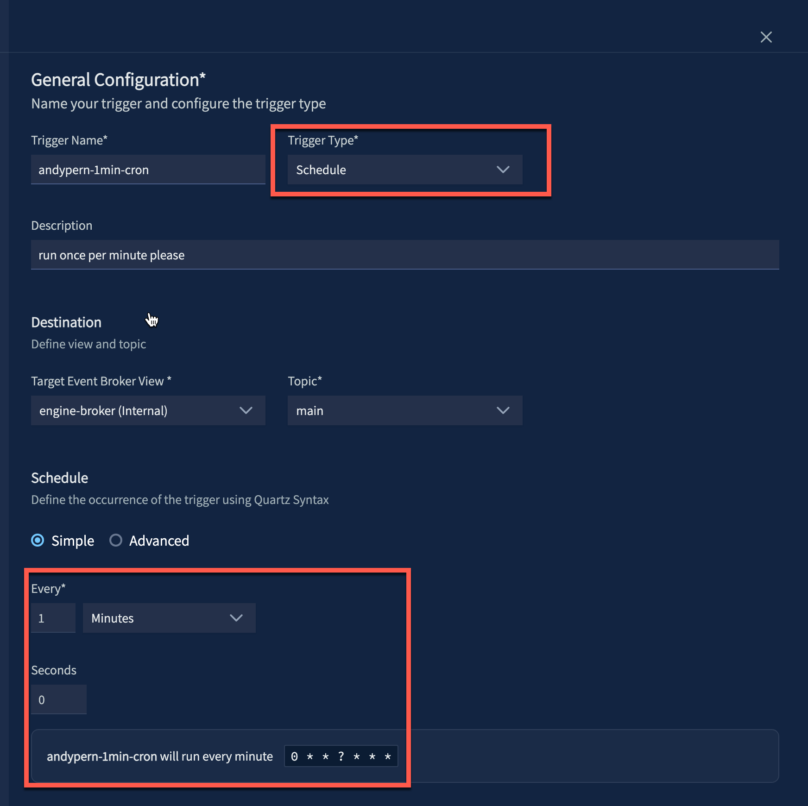
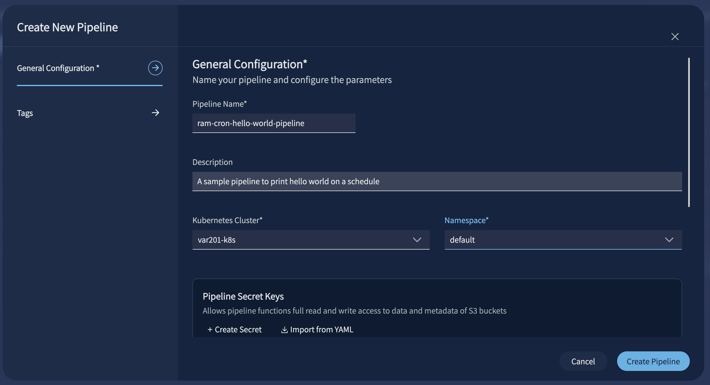
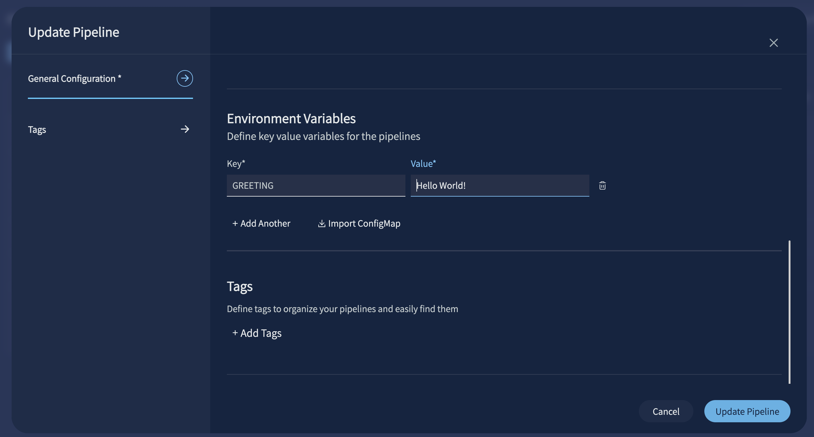
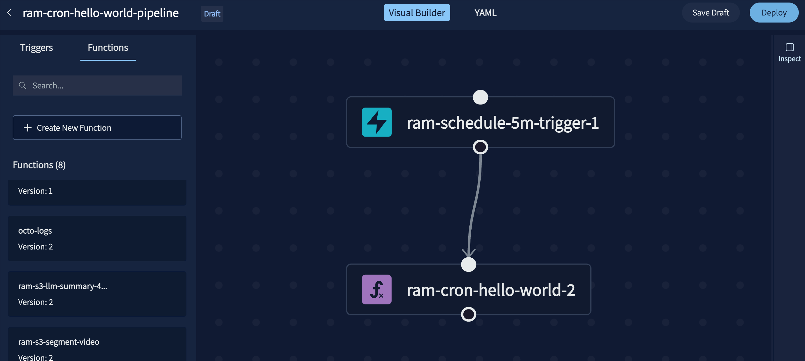

# Lab 1: Hello VAST Data (20 min)

## Overview

Get acquainted with the development flow: scaffold a function from scratch, understand the init/handler model, and deploy a scheduled pipeline end-to-end. Minimal coding; maximum platform familiarity.

```
  Schedule Trigger (every 5 min)
            │
            ▼
  ┌─────────────────────────┐
  │   DataEngine Pipeline   │
  │  ┌─────────────────────┐│
  │  │     Function        ││
  │  │  init(ctx)          ││ ← reads GREETING env var
  │  │  handler(ctx, event)││ ← logs greeting,
  │  │                     ││   returns response
  │  └─────────────────────┘│
  └─────────────────────────┘
            │
            ▼
     vastde logs tail
  ("Hello, World!" on schedule)
```

## Scenario

You've just joined the engineering team at **FrameIQ**, a startup building AI-powered video intelligence pipelines. Before touching any real data, you need to know how the platform works end-to-end. This lab walks you through the full flow using the simplest possible example.


## Steps

> All commands run on the **workshop VM** via the terminal in your browser. Nothing runs on your laptop.

### Step 1: Scaffold a new function

#### 1a. Check the CLI is available

```sh
vastde --help
```

#### 1b. Let's scaffold a brand new function

Before we jump into lab 1 let's understand how to create a function from scratch:

```sh
cd labs/
vastde functions init python-pip $USER-my-first-vast-function
cd $USER-my-first-vast-function
```

This generates the boilerplate directory:

```
cd $USER-my-first-vast-function/
tree
├── main.py               ← your function logic
├── requirements.txt      ← Python dependencies
├── config.yaml           ← env vars for local dev
└── pipeline-config.yaml  ← pipeline definition (trigger, function, links)
```

> **Why $USER?** In a shared environment, prefixing with your username keeps your resources unique from others.
---

### Step 2: Write the greeting

Now that we've gone over how to scaffold a function, let's jump into `/lab1` and work from there.

Update `main.py`:

```python
# main.py
import os

def init(ctx):
    greeting = os.environ.get('GREETING', 'Hello!')
    ctx.logger.info(f"Initialized with greeting: {greeting}")

def handler(ctx, event):
    ctx.logger.info(f"Handler triggered: {event}")
    return "Hello VAST Data"
```

---

### Step 3: Build and run locally

Build the function image:

```sh
# labs/lab1-hello-world/
vastde functions build $USER-hello-world
```

⏱️ This step takes a moment.

Expected output:

```
Detected language: python
Validating Python version 3.12.*...
Python version 3.12.* resolved to 3.12.12
Building $USER-hello-world:latest
App Path: .../lab1-hello-world
Handlers File: main.py
2026/03/18 14:22:18 [Started] Python Builder: $USER-hello-world:latest
2026/03/18 14:22:34 [Completed] Python Builder: $USER-hello-world:latest
Build completed: $USER-hello-world:latest
```

Create your local config from the template. Skip this step if `config.yaml` already exists (created by `setup.py`):

```sh
cp -n config.example.yaml config.yaml
```

Then run locally:

```sh
vastde functions localrun $USER-hello-world -c config.yaml
```

Expected output:

```sh
% vastde functions localrun $USER-hello-world -c config.yaml
Running function 'workshop-hello-world:latest' as Docker container on port 8080
Failed to load config from config.yaml: failed to read config file config.yaml: open config.yaml: no such file or directory

Function is starting on port 8080... Once ready, you can invoke it:
In another terminal, run:

  # Generate and send a test event:
  vastde functions invoke --generate-event --url http://localhost:8080/

  # Send a custom CloudEvent:
  vastde functions invoke --event cloudevent.yaml --url http://localhost:8080/

Press Ctrl+C to stop the function

2026-05-07 02:33:32 [INFO] Vast Runtime, Version: 0.1.0+edaa62cc6748
2026-05-07 02:33:32 [INFO] Starting Vast Runtime
2026-05-07 02:33:32 [INFO] App Path: /workspace
2026-05-07 02:33:32 [INFO] Handler: main.py
2026-05-07 02:33:32 [WARNING] overriding custom non json response default response class
2026-05-07 02:33:32 [INFO] Runtime is listening on port 8080
2026-05-07 02:33:32 [INFO] Call Init Handler: init
2026-05-07 02:33:32 [INFO] Initialized with greeting: Hello VAST Data
2026-05-07 02:33:32 [INFO] Init Handler Completed, duration: 0:00:00.000053
2026-05-07 02:33:32 [INFO] init handler completed in timestamp 2026-05-07 02:33:32.629215
```

In a second terminal:

```sh
vastde functions invoke --generate-event --url http://localhost:8080/
```

Expected output:

```
Generated CloudEvent with type: vastdata.com:Element.ObjectCreated
Sending CloudEvent to http://localhost:8080/
Event ID: 537d53e4-f7d4-49de-86c4-a4e49d1992a6
Event Type: vastdata.com:Element.ObjectCreated
CloudEvent sent successfully (Status: 204)
```

Going back to the first terminal to view the triggered event:
```sh
2026-05-07 02:35:14 [INFO] START EventId: 07b00d89-e511-4027-a5fd-f5cfc2cc128f, EventType: vastdata.com:Element.ObjectCreated, EventSource: vastdata.com:trigger1.d6a1c6a8-e70b-4268-80c8-9b539918d4eb, Timestamp: 1778121314.0327199
2026-05-07 02:35:14 [INFO] Function invoked in timestamp 2026-05-07 02:35:14.035809
2026-05-07 02:35:14 [INFO] event type: Element
2026-05-07 02:35:14 [INFO] Starting running function in timestamp 2026-05-07 02:35:14.038024
2026-05-07 02:35:14 [INFO] Received event: {'attributes': {'source': 'vastdata.com:trigger1.d6a1c6a8-e70b-4268-80c8-9b539918d4eb', 'id': '07b00d89-e511-4027-a5fd-f5cfc2cc128f', 'type': 'vastdata.com:Element.ObjectCreated', 'specversion': '1.0', 'time': '2026-05-06T22:35:13-04:00', 'subject': 'vastdata.com:kafka-view.default-topic', 'datacontenttype': 'application/json', 'dataschema': None, 'triggerext1': 'cli-generated', 'triggerext2': 'test-event'}, 'data': {'data': {'msg': 'hello'}, 'datacontenttype': 'application/json', 'id': '07b00d89-e511-4027-a5fd-f5cfc2cc128f', 'source': 'vastdata.com:trigger1.d6a1c6a8-e70b-4268-80c8-9b539918d4eb', 'specversion': '1.0', 'subject': 'vastdata.com:kafka-view.default-topic', 'time': '2026-05-06T22:35:13-04:00', 'triggerext1': 'cli-generated', 'triggerext2': 'test-event', 'type': 'vastdata.com:Element.ObjectCreated'}}
2026-05-07 02:35:14 [INFO] Function returned: Hello VAST Data! in timestamp 2026-05-07 02:35:14.038550
2026-05-07 02:35:14 [INFO] No sink URL configured
2026-05-07 02:35:14 [INFO] END EventId: 07b00d89-e511-4027-a5fd-f5cfc2cc128f, Duration: 0.0067s, Response: <starlette.responses.Response object at 0x7ffffbfcc860>, Timestamp: 1778121314.0397043
INFO:     192.168.65.1:25074 - "POST / HTTP/1.1" 204 No Content
```

> **Notice:** The `Received event:` log shows the full CloudEvent payload your function receives. In later labs, `data.Records` inside this payload will carry the S3 bucket name and object key. The `Function returned:` line shows what `handler()` returned. In later labs this becomes a structured dict passed to the next function in the pipeline.

---

### Step 4: Build, tag, and push

> **Note:** `DE_REG_HOST`, `DE_REG_USER`, and `DE_REG_NAME` are pre-set on your workshop VM. Run `env | grep DE_REG` to verify before pushing.

```sh
# labs/lab1-hello-world/
vastde functions build $USER-hello-world
```

Expected output for `vastde functions build`:

```
Detected language: python
Validating Python version 3.12.*...
Python version 3.12.* resolved to 3.12.12
Building $USER-hello-world:latest
App Path: .../lab1-hello-world
Handlers File: main.py
Build log: .../lab1-hello-world/build.log
2026/03/18 14:22:18 [Started] Python Builder: $USER-hello-world:latest
2026/03/18 14:22:34 [Completed] Python Builder: $USER-hello-world:latest
Build completed: $USER-hello-world:latest
Build log saved to: .../lab1-hello-world/build.log
```

Tag and push to the workshop registry:

```sh
docker tag $USER-hello-world:latest $DE_REG_HOST/$DE_REG_USER/$USER-hello-world:latest
docker push $DE_REG_HOST/$DE_REG_USER/$USER-hello-world:latest
```

⏱️ This step takes a moment.

---

### Step 5: Create the function in DataEngine (CLI)

Register the function using the image you just pushed:

```sh
vastde functions create \
  --name $USER-hello-world \
  --container-registry $DE_REG_NAME \
  --artifact-source $DE_REG_USER/$USER-hello-world \
  --image-tag latest
```

> **Tip:** If `vastde functions create` fails with a version conflict, verify the image tag exists locally before pushing:

```sh
docker images | grep hello-world
```

Expected output:

```
Function created: $USER-hello-world
Name: $USER-hello-world
Tags: []
GUID: <guid>
Owner: [id: <id>, id-type: vid]
VRN: vast:dataengine:functions:$USER-hello-world
Last Revision: 1
```

Verify:

```sh
vastde functions list | grep $USER
```

Expected output:

```
Function Name              Description                          Guid                                    Updated at
---------------------------------------------------------------------------------------------------------------------------
$USER-hello-world                                               cf82b693-5483-4490-8a01-29f44e948149    2026-03-18 18:50
```

---

### Step 6: Create a scheduled trigger (UI)

To load the UI, click on `Open VAST Data Cluster` and login using the `Lab Assets` received at the beginning:



Navigate to **DataEngine UI > Triggers > Create Trigger**.



Fill in the following fields:

| Field | Value |
|---|---|
| **Name** | `$USER-schedule-5m-trigger` |
| **Trigger Type** | `Schedule` |
| **Schedule** | `*/5 * * * *` |
| **Description** | fires every 5 minutes |

Verify via CLI:

```sh
vastde triggers list | grep $USER
```

Expected output:

```
Trigger Name                    Status   Type   Description               GUID                        Updated at
---------------------------------------------------------------------------------------------------------------------
$USER-schedule-5m-trigger       Ready    ...    Schedule trigger...       4d32fd72-7961-4b00-940b...  2026-03-29 21:23
```

---

### Step 7: Create and deploy the pipeline (UI)

Navigate to **DataEngine UI > Pipelines > Create Pipeline**:



Fill in the following fields:

| Field | Value |
|---|---|
| **Name** | `$USER-hello-world-pipeline` |
| **Description** | A sample pipeline to print hello world on a schedule |

Update the environment variables to include `GREETING` variable and click `Create/Update Pipeline`:



Connect the trigger to the function to create the pipeline:



Click `Deploy` and wait for `Running` status before proceeding.

⏱️ This step takes a moment.

You can also verify via CLI:

```sh
vastde pipelines list | grep $USER
```

```sh
vastde pipelines list | grep $USER
workshop-cro...  Ready         A sample pipeline...  86854c6c-c2fe-4a5...  2026-05-07 ...
```

---

### Step 8: Tail the logs

Stream logs from the deployed pipeline:

```sh
vastde logs tail $USER-hello-world-pipeline \
  --function $USER-hello-world \
  --since 1h
```

Wait up to 5 minutes for the schedule to fire. You should see:

```
2026-05-06 23:01:40.43 [workshop-hello-world] [INFO]  [user] Initialized with greeting: Hello VAST!
2026-05-06 23:05:00.90 [workshop-hello-world] [INFO]  [user] Received event: {'attributes': {'source': 'vastdata.com:workshop-scheduler-5m-trigger.15473f0a-b257-4b76-ab18-be7aea172c25', 'id': 'efa7325c-3194-4e03-87f7-a66059b4e696', 'type': 'vastdata.com:Schedule.TimerElapsed', 'specversion': '1.0', 'time': '2026-05-07T03:05:00.808000+00:00', 'subject': 'mlops-broker.main', 'datacontenttype': 'application/json', 'dataschema': None, 'cronschedule': '0 0/5 * ? * * *', 'knativekafkaoffset': '0', 'knativekafkapartition': '12', 'partitionkey': 'efa7325c-3194-4e03-87f7-a66059b4e696', 'timerelapsedtimestamp': '2026-05-07T03:05:00.000523Z'}, 'data': {'message': 'Activating trigger by cron'}}
```

---

## Key Takeaways

- `init()` runs once at cold start; `handler()` runs on every event. Keep expensive setup in `init()`
- Env vars are set on the pipeline, not hardcoded in the function; read them with `os.environ`
- `ctx.logger` is the right way to emit logs; visible in real time via `vastde logs tail`

---

**Next up: [Lab 2: Connect to S3](../lab2-s3-connect/)**
