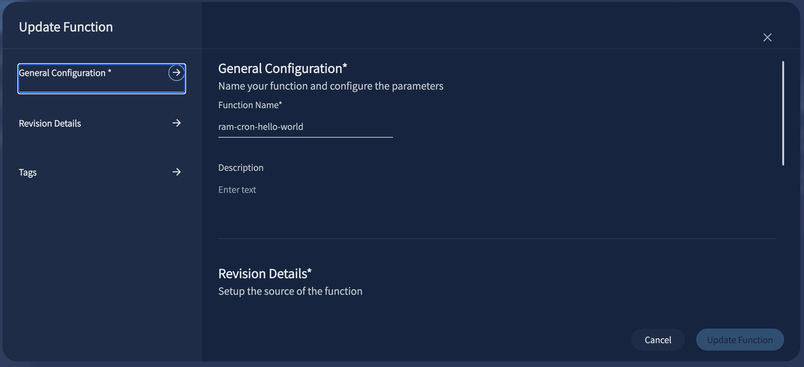
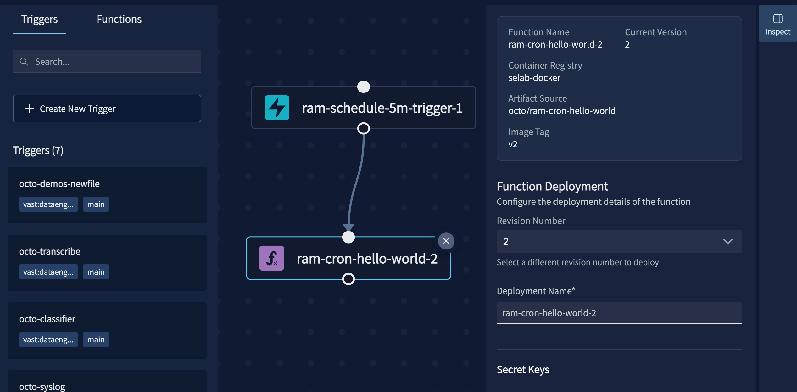
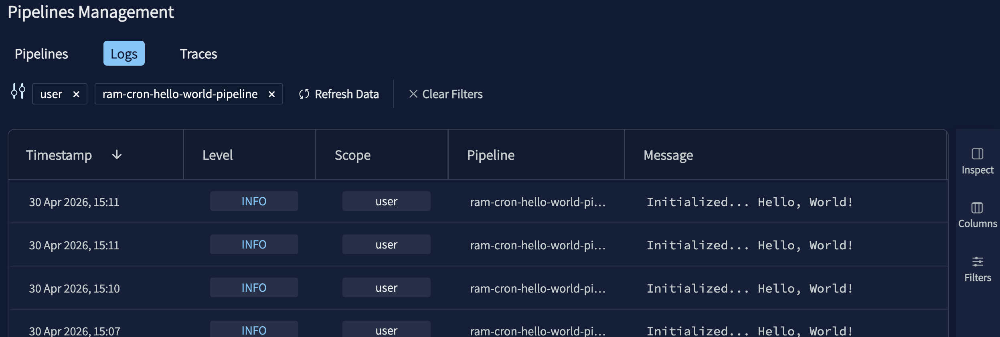
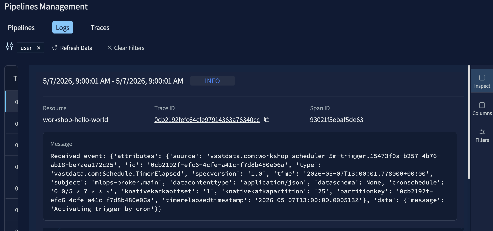

# Lab 2: Connect to S3 (15 min)

## Overview

Swap your schedule trigger for an S3 element trigger, explore the DataEngine UI, and watch your function fire when a file lands in your bucket. No code changes, just wiring and observation.

```
  S3 Bucket [s3://$USER-lab]
      │ (file upload via S3 UI)
      ▼
  Element Trigger
      │ (fires on ObjectCreated)
      ▼
  ┌─────────────────────────┐
  │   DataEngine Pipeline   │
  │  ┌─────────────────────┐│
  │  │  Function           ││
  │  │  handler(ctx, event)││ ← logs CloudEvent payload
  │  └─────────────────────┘│
  └─────────────────────────┘
      │
      ▼
   vastde logs tail
   (CloudEvent with bucket + key)
```

## Scenario

At **FrameIQ**, pipelines don't run on a clock, they react to data. A new video file lands in a bucket and the pipeline wakes up. In this lab you'll rewire your pipeline from a schedule trigger to an S3 element trigger, which is the foundation for every data pipeline you'll build in Labs 3 onwards. You'll also get a guided tour of the DataEngine UI so you know where to look when things need debugging.


## Steps

> All commands run on the **workshop VM** via the terminal in your browser. Nothing runs on your laptop.

### Step 1: Explore the DataEngine UI

Before making any changes, orient yourself in the DataEngine UI.

#### 1a. Functions view

Navigate to **DataEngine UI > Manage Elements > Functions**. You should see your `$USER-hello-world` function from Lab 1. Spend a few minutes exploring: open the function (right click + `edit`), look at its details, and see what information is available:



- Under `Revision Details`, the function version can be updated by changing the `Image Tag` (e.g. v1, v2, v3)

#### 1b. Pipelines view

Navigate to **DataEngine UI > Pipeline Management > Pipelines Management **. Click into your pipeline (right click + `Go To Builder`) to see the pipeline graph, trigger linked to function. Spend a few minutes exploring the pipeline graph and the configuration panels (select function + click `Inspect`).



- Under `Function Deployment`, the function version can be updated by changing the `Revision Number` (e.g. 1, 2, 3)
- In the configuration panel of the function, scroll down to explore the `Deployment Resources`
- Check out the `YAML` to see the pipeline configuration
- The `Deploy` button will deploy the pipeline to capture any relevant changes (e.g. new trigger, function version)

#### 1c. Logs view

Navigate to **DataEngine UI > Pipeline Management > Logs**. This is where invocation traces live, you'll use this throughout the workshop. Click into a past invocation from Lab 1 and see what was logged.



- Click on a specific log to see what information is available
- Navigate to a specific log and view the trace details


---

### Step 2: Create an S3 element trigger

Navigate to **DataEngine UI > Manage Elements > Triggers > Create Trigger** and fill in:

| Field | Example value |
|---|---|
| **Name** | `$USER-s3-trigger` |
| **Trigger Type** | `Element` |
| **Source View** | select your `$USER-lab` bucket |
| **Element Type** | `Element Created` |

Verify via CLI:

```sh
vastde triggers list | grep $USER
```

Expected output:

```
Trigger Name               Status        Type        Description      GUID                        Updated at
------------------------------------------------------------------------------------------------------------------
$USER-s3-trigger           Ready         0xc0006...                   4d32fd72-7961-4b00-940b...  2026-03-29 21:23
```

---

### Step 3: Update the pipeline to use the new trigger

Navigate to **DataEngine UI > Pipeline Management > Pipeline Management** and click into your pipeline, $USER-cron-hello-world-pipeline.

Remove the existing schedule trigger link and connect your new S3 trigger to the function.

Once updated, redeploy the pipeline from the UI by clicking `Deploy`.

---

### Step 4: What is a CloudEvent?

When a file is uploaded to your S3 bucket, a **CloudEvent** is passed to your function's `handler()`. Here's what it looks like:

```json
{
  "id": "59e46a1b-b060-49e8-8438-3dc03095a0da",
  "source": "vastdata.com:trigger1.7c99196c-6c16-4c84-b87d-c1d7861d0ba4",
  "specversion": "1.0",
  "type": "vastdata.com:Element.ObjectCreated",
  "time": "2025-10-10T13:38:09Z",
  "subject": "vastdata.com:kafka-view.default-topic",
  "datacontenttype": "application/json",
  "dataschema": null,
  "triggerext1": "cli-generated",
  "triggerext2": "test-event",
  "data": {
    "Records": [
      {
        "s3": {
          "bucket": { "name": "your-bucket-name" },
          "object": { "key": "sample.txt" }
        }
      }
    ]
  }
}

```

In Lab 3 you'll parse this payload to extract the bucket name and object key and act on the file.

---

### Step 5: Upload a file and verify

Before uploading, confirm the pipeline is in `Ready` status:

```sh
vastde pipelines list | grep $USER
```

#### 5a. Upload a file

> **Note:** Your S3 bucket name and credentials are pre-configured on the workshop VM. Run `env | grep S3` to see the values before filling in `config.yaml` and `secrets.yaml`.

Upload the sample file to your S3 bucket:

```sh
s3cmd put ./test.md s3://$USER-labs/test.md
```

Expected output:

```
upload: './test.md' -> 's3://$USER-labs/test.md'  [1 of 1]
 15 of 15   100% in    0s  1548.79 B/s  done
```

#### 5b. Check the logs

Tail the pipeline logs to see the CloudEvent your function received:

```sh
vastde logs tail $USER-hello-world-pipeline \
  --function $USER-hello-world \
  --since 5m
```

You should see the CloudEvent payload:

```
vastdata@mlops-builder:~/mlops-workshop-nyc-2026$ vastde logs tail $USER-cron-hello-world-pipeline --function $USER-hello-world --since 5m
2026-05-07 16:02:44.27 [workshop-hello-world] [INFO]  [user] Received event: {'attributes': {'source': 'vastdata.com:workshop-s3-trigger.25d743ba-5c35-4524-a165-5a6566801b63', 'id': '105849469009922', 'type': 'vastdata.com:Element.ElementCreated', 'specversion': '1.0', 'time': '2026-05-07T16:02:44.219831+00:00', 'subject': 'vast-broker-mlops-broker.main', 'datacontenttype': 'application/json', 'dataschema': None, 'elementhandle': '2123887763190716068', 'elementpath': 'workshop-lab2/README.md', 'elementsourcetype': 'vast:s3', 'knativekafkaoffset': '1', 'knativekafkapartition': '24'}, 'data': {'Records': [{'eventVersion': '2.2', 'eventSource': 'vast:s3', 'awsRegion': 'poc-var-208', 'eventTime': '2026-05-07T16:02:44.219831Z', 'eventName': 'ObjectCreated:Put', 'userIdentity': {'principalId': 'workshop'}, 'requestParameters': {'sourceIPAddress': '172.200.12.148'}, 'responseElements': {'x-amz-request-id': '0x6041000df9f2', 'x-amz-id-2': '0x6041000df9f2'}, 's3': {'s3SchemaVersion': '1.0', 'configurationId': 'workshop-s3-trigger.25d743ba-5c35-4524-a165-5a6566801b63', 'bucket': {'name': 'workshop-lab2', 'ownerIdentity': {'principalId': 'workshop'}, 'arn': 'arn:aws:s3:::workshop-lab2'}, 'object': {'key': 'README.md', 'size': 1784, 'eTag': 'd5b693e7178ba45711af2700ca3b901a', 'sequencer': '004100000000000f4241'}}}]}}
```

---

## Key Takeaways

- **Element triggers** fire on S3 object events (`ObjectCreated`, `ObjectDeleted`); more efficient than polling on a schedule
- **CloudEvents** are a standard envelope DataEngine uses to pass event metadata to your function; always contains the bucket name and object key
- **DataEngine UI** is your primary tool for wiring triggers to functions, monitoring pipeline status, and inspecting invocation logs
- **Event-driven vs schedule-driven**: schedules are useful for periodic jobs; event triggers are the right model when you want to react to data as it arrives

---

**Next up: [Lab 3: Read from S3 and Summarize with an LLM](../lab3-llm-connect/)**
