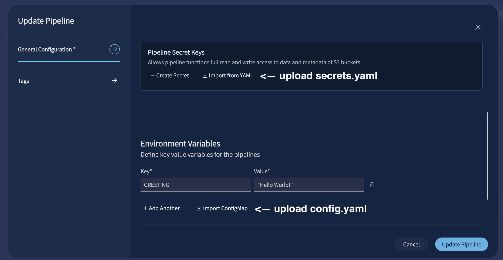

# Lab 3: Read from S3 and Summarize with an LLM (20 min)

## Overview

Build a DataEngine function that reads an incoming S3 event, fetches the triggered file from your bucket, and summarizes its contents using an LLM.

```
  S3 Bucket
      │ (file upload)
      ▼
  Element Trigger
      │ (CloudEvent)
      ▼
  ┌──────────────────────────────┐
  │   DataEngine Function        │
  │                              │
  │  handler()                   │
  │   ├─ parse bucket + key      │
  │   ├─ s3_client.get_object()  │
  │   └─ llm_summary(content)    │
  └──────────────────────────────┘
      │
      ▼
   vastde logs tail
   ("Summary: ...")
```

## Scenario

At **FrameIQ**, a video file lands in S3 and the pipeline needs to do something useful with it. In this lab you'll implement the core concepts that make that happen:
- parse the incoming event to find the file,
- fetch it from S3, and
- send its contents to an LLM to generate a summary.

> All commands run on the **workshop VM** via the terminal in your browser. Nothing runs on your laptop.

## Steps

### Step 1: Parse the S3 event

The starter `main.py` includes the function structure with TODOs. Your first task is to extract the bucket name and object key from the incoming CloudEvent.

The `common/handler_utils.py` file is provided in this lab directory. It contains a `parse_s3_event(event)` helper that extracts the bucket name and object key from the CloudEvent `Records` array and handles URL-decoding of the key.

#### 1a. Update `handler()` in `main.py`

```python
from common.handler_utils import parse_s3_event

def handler(ctx, event):
    s3_bucket, s3_key = parse_s3_event(event)
    if not s3_bucket:
        ctx.logger.warning("No records found in event")
        return

    ctx.logger.info(f"📦 Bucket: {s3_bucket}")
    ctx.logger.info(f"📄 Key: {s3_key}")
```

#### 1b. Test locally

Build and run the function locally:

```sh
vastde functions build $USER-s3-llm-summary
vastde functions localrun $USER-s3-llm-summary -c config.yaml
```

In a second terminal, invoke with the sample CloudEvent:

```sh
vastde functions invoke --event ./cloudevent.json --url http://localhost:8080/
```

Expected output:

```
2026-04-17 17:22:33 [INFO] START EventId: 59e46a1b-b060-49e8-8438-3dc03095a0da, EventType: vastdata.com:Element.ObjectCreated, EventSource: vastdata.com:$USER-s3-trigger.7c99196c-6c16-4c84-b87d-c1d7861d0ba4, Timestamp: 1776446553.0095024
2026-04-17 17:22:33 [INFO] Function invoked in timestamp 2026-04-17 17:22:33.011881
2026-04-17 17:22:33 [INFO] event type: Element
2026-04-17 17:22:33 [INFO] Starting running function in timestamp 2026-04-17 17:22:33.013387
2026-04-17 17:22:33 [INFO] 📦 Bucket: your-bucket-name
2026-04-17 17:22:33 [INFO] 📄 Key: test.md
```

---

### Step 2: Wire the S3 client and fetch the file

Update `init()` to set up the S3 client and update `handler()` to fetch the file content.

The `common/config_utils.py` file is provided in this lab directory. It contains a `validate_config(ctx, required_envs, required_secrets, secrets)` helper that checks all required environment variables and secrets are set, logs their status without exposing values, and raises if anything is missing.

#### 2a. Wire the S3 client in `init()`

```python
import boto3
import os
from common.config_utils import validate_config

def init(ctx):
    secrets = ctx.secrets.get("secrets", {})

    validate_config(
        ctx,
        required_envs=["S3_ENDPOINT_URL", "S3_REGION", "LLM_ENDPOINT", "MODEL_NAME"],
        required_secrets=["S3_ACCESS_KEY", "S3_SECRET_KEY", "LLM_API_KEY"],
        secrets=secrets,
    )

    s3_access_key = secrets.get("S3_ACCESS_KEY", "")
    s3_secret_key = secrets.get("S3_SECRET_KEY", "")

    ctx.s3_client = boto3.client(
        's3',
        use_ssl=False,
        endpoint_url=os.environ.get('S3_ENDPOINT_URL'),
        aws_access_key_id=s3_access_key,
        aws_secret_access_key=s3_secret_key,
        region_name=os.environ.get('S3_REGION'),
        config=boto3.session.Config(
            signature_version='s3v4',
            s3={'addressing_style': 'path'}
        )
    )
    ctx.logger.info("✅ S3 client initialized")
```

#### 2b. Fetch the file in `handler()`

Add the following after parsing the bucket and key:

```python
ctx.logger.info("⬇️ Fetching file from S3...")
response = ctx.s3_client.get_object(Bucket=s3_bucket, Key=s3_key)
content = response['Body'].read().decode('utf-8')
ctx.logger.info(f"✅ File fetched — size: {response['ContentLength']} bytes, type: {response['ContentType']}")
```

#### 2c. Configure and deploy

Before deploying, set up all environment variables and secrets now (both S3 and LLM) so you won't need to redeploy after Step 3.

**Environment Variables**

Copy the config template and fill in your values:

> **TODO:** Add instructions for how to retrieve S3 and LLM credentials in the workshop environment (endpoint URLs, access keys, API key).

```sh
cp config.example.yaml config.yaml
```

Update `config.yaml`:

```yaml
S3_ENDPOINT_URL: "<your-s3-endpoint>"
S3_REGION: "<your-region>"
LLM_ENDPOINT: "<your-llm-endpoint>"
MODEL_NAME: "<your-model-name>"
MAX_TOKENS: "512"
```

**Secrets**

Copy the secrets template and fill in your values:

```sh
cp secrets.example.yaml secrets.yaml
```

Update `secrets.yaml`:

```yaml
secrets:
  S3_ACCESS_KEY: "<your-s3-access-key>"
  S3_SECRET_KEY: "<your-s3-secret-key>"
  LLM_API_KEY: "<your-llm-api-key>"
```

**Function**

Build, tag, and push following the same pattern from Lab 1:

```sh
vastde functions build $USER-s3-llm-summary
docker tag $USER-s3-llm-summary:latest $DE_REG_HOST/$DE_REG_USER/$USER-s3-llm-summary:v1
docker push $DE_REG_HOST/$DE_REG_USER/$USER-s3-llm-summary:v1
```

Create the function:

```sh
vastde functions create \
  --name $USER-s3-llm-summary \
  --container-registry $DE_REG_NAME \
  --artifact-source $DE_REG_USER/$USER-s3-llm-summary \
  --image-tag v1
```

Expected output:

```
Function created: $USER-s3-llm-summary
Name: $USER-s3-llm-summary
Tags: []
GUID: <guid>
Owner: [id: <id>, id-type: vid]
VRN: vast:dataengine:functions:$USER-s3-llm-summary
Last Revision: 1
```

**Trigger**

Create a new S3 element trigger for this pipeline. Navigate to **DataEngine UI > Triggers > Create Trigger** and fill in:

| Field | Example value |
|---|---|
| **Name** | `$USER-s3-llm-summary-trigger` |
| **Trigger Type** | `Element` |
| **Source View** | select your S3 bucket |
| **Element Type** | `Element Created` |

**Pipeline**

Create and deploy the pipeline from the UI using `pipeline-config.yaml` as a reference (same flow as Lab 1 Steps 6-7).



When setting up the pipeline, add the environment variables from `config.yaml` under `Environment Variables` and upload `secrets.yaml` under `Secrets`. Once configured, click **Deploy** and wait for `Ready` status before proceeding.

#### 2d. Upload a file and verify

Upload the sample file to your S3 bucket:

```sh
s3cmd put ./sample.txt s3://<your-bucket>/sample.txt
```

Expected output:

```
upload: './sample.txt' -> 's3://<your-bucket>/sample.txt'  [1 of 1]
done
```

Then tail the logs:

```sh
vastde logs tail $USER-s3-llm-summary-pipeline \
  --function $USER-s3-llm-summary \
  --since 5m
```

You should see the file size logged:

```
2026-04-26 16:04:04.11 [$USER-s3-llm-summar...] [INFO]  [user] ✅ File fetched — size: 1120 bytes, type: text/plain
```

---

### Step 3: Wire the LLM client and write `llm_summary()`

With the file content in hand, update `init()` to set up the LLM client and implement `llm_summary()`.

The `common/llm_client.py` file is provided in this lab directory. It contains an `LLMClient` class that wraps the OpenAI-compatible API, handles streaming responses, and strips any `<think>` tokens from the output. Initialize it with:

```python
LLMClient(endpoint, api_key, model, max_tokens=512)
```

#### 3a. Add the LLM client to `init()`

Update `init()` to wire both clients and attach them to `ctx`:

```python
from common.llm_client import LLMClient
from common.config_utils import validate_config

def init(ctx):
    secrets = ctx.secrets.get("secrets", {})

    validate_config(
        ctx,
        required_envs=["S3_ENDPOINT_URL", "S3_REGION", "LLM_ENDPOINT", "MODEL_NAME"],
        required_secrets=["S3_ACCESS_KEY", "S3_SECRET_KEY", "LLM_API_KEY"],
        secrets=secrets,
    )

    # S3 client (from Step 2)
    s3_access_key = secrets.get("S3_ACCESS_KEY", "")
    s3_secret_key = secrets.get("S3_SECRET_KEY", "")
    ctx.s3_client = boto3.client(
        's3',
        use_ssl=False,
        endpoint_url=os.environ.get('S3_ENDPOINT_URL'),
        aws_access_key_id=s3_access_key,
        aws_secret_access_key=s3_secret_key,
        region_name=os.environ.get('S3_REGION'),
        config=boto3.session.Config(
            signature_version='s3v4',
            s3={'addressing_style': 'path'}
        )
    )
    ctx.logger.info("✅ S3 client initialized")

    # LLM client
    ctx.llm_client = LLMClient(
        endpoint=os.environ.get('LLM_ENDPOINT'),
        api_key=secrets.get("LLM_API_KEY", ""),
        model=os.environ.get('MODEL_NAME', 'gpt-4o-mini'),  # TODO: update default to workshop model
        max_tokens=int(os.environ.get('MAX_TOKENS', '512')),
    )
    ctx.logger.info(f"✅ LLM client initialized → {os.environ.get('LLM_ENDPOINT')}")
```

#### 3b. Write `llm_summary()`

```python
def llm_summary(ctx, content):
    return ctx.llm_client.summarize(content)
```

#### 3c. Call `llm_summary()` in `handler()`

Add the following after fetching the file content:

```python
ctx.logger.info("🤖 Calling LLM for summary...")
summary = llm_summary(ctx, content)
ctx.logger.info(f"✅ Summary: {summary}")
return {"bucket": s3_bucket, "key": s3_key, "summary": summary}
```

#### 3d. Update the function

Build and push the updated image:

```sh
vastde functions build $USER-s3-llm-summary
docker tag $USER-s3-llm-summary:latest $DE_REG_HOST/$DE_REG_USER/$USER-s3-llm-summary:v2
docker push $DE_REG_HOST/$DE_REG_USER/$USER-s3-llm-summary:v2
```

Then update the function revision in the UI.

> **Hint:** We covered function revisions in Lab 2 Step 1a. Navigate to **DataEngine UI > Functions > `$USER-s3-llm-summary` > Revision Details** and update the `Image Tag` to `v2`. Then open your pipeline in the **Pipeline Builder**, ensure the latest function revision is selected under **Function Deployment**, and click **Deploy**.

---

### Step 4: Verify end to end

Upload the sample text file to your S3 bucket to trigger the pipeline:

```sh
s3cmd put ./sample.txt s3://<your-bucket>/sample.txt
```

Expected output:

```
upload: './sample.txt' -> 's3://<your-bucket>/sample.txt'  [1 of 1]
done
```

Stream logs from the deployed pipeline:

```sh
vastde logs tail $USER-s3-llm-summary-pipeline \
  --function $USER-s3-llm-summary \
  --since 5m
```

You should see the full pipeline run logged:

```
2026-04-26 16:04:04.08 [$USER-s3-llm-summar...] [INFO]  [user] ℹ️ Handler invoked
2026-04-26 16:04:04.08 [$USER-s3-llm-summar...] [INFO]  [user] 📦 Bucket: <your-bucket>
2026-04-26 16:04:04.08 [$USER-s3-llm-summar...] [INFO]  [user] 📄 Key: sample.txt
2026-04-26 16:04:04.08 [$USER-s3-llm-summar...] [INFO]  [user] ⬇️ Fetching file from S3...
2026-04-26 16:04:04.11 [$USER-s3-llm-summar...] [INFO]  [user] ✅ File fetched — size: 1120 bytes, type: text/plain
2026-04-26 16:04:04.11 [$USER-s3-llm-summar...] [INFO]  [user] 🤖 Calling LLM for summary...
2026-04-26 16:04:29.63 [$USER-s3-llm-summar...] [INFO]  [user] ✅ Summary: The given text appears to be a passage of Lorem Ipsum...
```

---

## Key Takeaways

- **ctx.secrets** stores sensitive credentials separately from code and config; never log secret values, only whether they are set
- **llm_summary()** takes file content and returns a plain text summary; the model and token limit are configurable via env vars

---

**Next up: [Lab 4: Video Ingestion Pipeline](../lab4-video-ingest/)**
