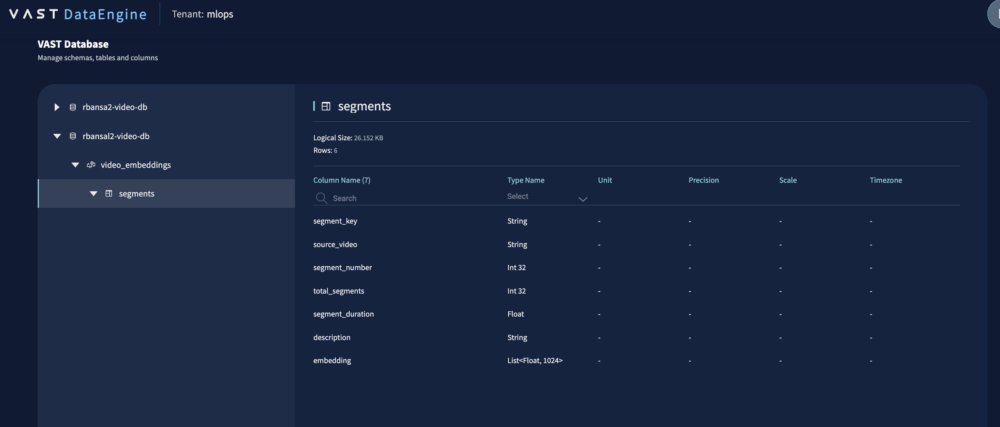
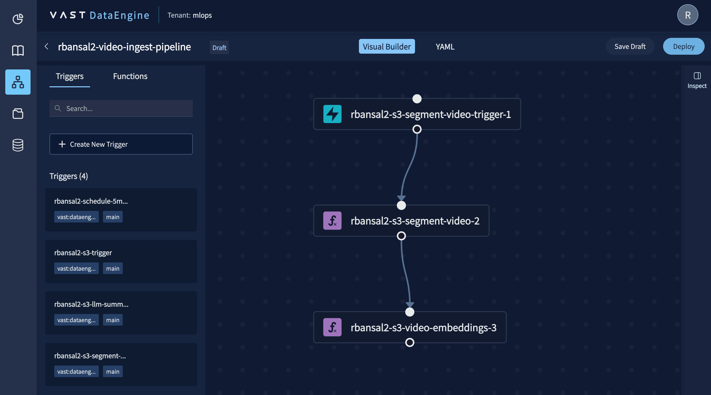

# Lab 5: Generate Video Embeddings (30 min)

## Overview

Build a function that receives video segment keys from the upstream pipeline, downloads each segment, extracts 3 representative frames, sends them to a vision model to generate a description, produces a 1024-dimension embedding vector, and stores the results in VastDB.

```
  Lab 4 Function
      │ ({"segment_keys": [...], "output_bucket": "..."})
      ▼
  ┌──────────────────────────────────────────┐
  │   DataEngine Function (f2f)              │
  │                                          │
  │  process_segments()                      │
  │   ├─ get_object() per segment            │
  │   ├─ extract 3 frames (moviepy + PIL)    │
  │   ├─ vision model → description          │
  │   ├─ embedding model → vector[1024]      │
  │   └─ vastdb.insert() per segment         │
  └──────────────────────────────────────────┘
      │
      ▼
  VastDB [$USER-video-db] (video_embeddings.segments)
```

## Scenario

At **FrameIQ**, video segments are already landing in S3 from the previous pipeline step. But raw video files are not searchable. You need meaning attached to each clip. In this lab you'll implement the function that sits downstream of the segmenter: for each segment, extract representative frames, describe what is happening using a vision model, convert that description into a vector embedding, and store everything in VastDB so it can be queried semantically later.


## Steps

> All commands run on the **workshop VM** via the terminal in your browser. Nothing runs on your laptop.

### Step 1: Download the segment and extract frames

Your first task is to implement `process_segments()`, starting with downloading each segment from S3 and extracting 3 representative frames.

#### 1a. Download the segment in `process_segments()`

Inside the `for segment_key in segment_keys` loop, download the segment from S3:

```python
# labs/lab5-video-embeddings/main.py
try:
    response = ctx.s3_client.get_object(Bucket=output_bucket, Key=segment_key)
    video_bytes = response["Body"].read()
    ctx.logger.info(f"Downloaded s3://{output_bucket}/{segment_key} ({len(video_bytes):,} bytes)")
except Exception as e:
    ctx.logger.error(f"Failed to download {segment_key}: {e}")
    continue
```

#### 1b. Extract 3 frames as JPEG

The vision model used in this workshop accepts images, not raw video. Write the segment to a tempfile, load it with `VideoFileClip`, and sample 3 evenly spaced frames as JPEG:

```python
# labs/lab5-video-embeddings/main.py
with tempfile.NamedTemporaryFile(suffix=".mp4", delete=False) as tmp:
    tmp.write(video_bytes)
    tmp_path = tmp.name

try:
    clip = VideoFileClip(tmp_path)
    num_frames = 3
    frame_times = [clip.duration * (i + 1) / (num_frames + 1) for i in range(num_frames)]
    frames = []
    for t in frame_times:
        frame = clip.get_frame(t)
        buf = BytesIO()
        Image.fromarray(frame).save(buf, format="JPEG")
        frames.append(buf.getvalue())
    clip.close()
    ctx.logger.info(f"Extracted {len(frames)} frames from {segment_key}")
except Exception as e:
    ctx.logger.error(f"Failed to extract frames from {segment_key}: {e}")
    continue
finally:
    os.unlink(tmp_path)
```

---

### Step 2: Generate a description and embedding vector

With frames extracted, call the vision model to describe what is happening in the clip, then pass that description to the embedding model to produce a vector.

#### 2a. Call the vision model with the frames

Build a multimodal request combining the text prompt with each frame encoded as base64, and call the vision model:

```python
# labs/lab5-video-embeddings/main.py
try:
    content = [{"type": "text", "text": "Describe what is happening in these video frames in 1 sentence."}]
    for frame_bytes in frames:
        frame_b64 = base64.b64encode(frame_bytes).decode("utf-8")
        content.append({"type": "image_url", "image_url": {"url": f"data:image/jpeg;base64,{frame_b64}"}})

    response = ctx.vlm_client.chat.completions.create(
        model=ctx.vision_model,
        messages=[
            {"role": "system", "content": "/no_think"},
            {"role": "user", "content": content},
        ],
        max_tokens=ctx.max_tokens,
        extra_body={"think": False},
    )
    msg = response.choices[0].message
    description = msg.content or getattr(msg, "reasoning", "")
    description = description.split("\n\n")[-1].strip()
    if ": " in description:
        parts = description.split(": ", 1)
        if len(parts[0]) < 60:
            description = parts[1].strip()
    if not msg.content and ctx.summary_model:
        summary_response = ctx.vlm_client.chat.completions.create(
            model=ctx.summary_model,
            messages=[{"role": "user", "content": f"Summarize this in one sentence: {description}"}],
            max_tokens=128,
        )
        description = summary_response.choices[0].message.content
    ctx.logger.info(f"Description: {description}")
except Exception as e:
    ctx.logger.error(f"Vision model failed for {segment_key}: {e}")
    continue
```

> **Why the summary fallback?** The vision models output analysis to a `reasoning` field and may leave `content` empty. The fallback passes that reasoning to a smaller model to produce a clean one-sentence description. See `SUMMARY_MODEL` in `config.example.yaml`.

#### 2b. Generate the embedding vector

If the description is empty, skip the segment. Otherwise, generate a vector:

```python
# labs/lab5-video-embeddings/main.py
if not description:
    ctx.logger.warning(f"Empty description for {segment_key} — skipping embedding")
    continue

embed_response = ctx.vlm_client.embeddings.create(
        model=ctx.embedding_model,
        input=description,
        dimensions=1024,
    )
embedding = embed_response.data[0].embedding

ctx.logger.info(f"Embedding: {len(embedding)} dimensions")

if not embedding:                                                                                                     
    ctx.logger.warning(f"Empty embedding for {segment_key} — skipping")
    continue
if len(embedding) != 1024:                                                                           
    ctx.logger.warning(f"Embedding has {len(embedding)} dimensions — truncating/padding to 1024")
    embedding = (embedding + [0.0] * 1024)[:1024]
```

---

### Step 3: Write to VastDB

Head over to the **DataEngine UI > Database > $USER-video-db** and confirm the VastDB is connected that includes the relevant tables for storing embeddings (`video-embeddings`):



If not, run the following in the command line:

```sh
pip install vastdb pyarrow
python setup_vastdb.py
```

Connect to VastDB and insert a row for each segment with its key, description, embedding, and metadata:

```python
# labs/lab5-video-embeddings/main.py
vastdb_session = connect_vastdb(ctx)
with vastdb_session.transaction() as tx:
    table = tx.bucket(ctx.vastdb_bucket).schema(ctx.vastdb_schema).table(ctx.vastdb_table)
    row = pa.table({
        "segment_key":      [segment_key],
        "source_video":     [source_key],
        "segment_number":   pa.array([segment_keys.index(segment_key) + 1], type=pa.int32()),
        "total_segments":   pa.array([len(segment_keys)], type=pa.int32()),
        "segment_duration": pa.array([float(data.get("segment_duration", 5))], type=pa.float32()),
        "description":      [description],
        "embedding":        [embedding],
    }, schema=pa.schema([
        ("segment_key",      pa.utf8()),
        ("source_video",     pa.utf8()),
        ("segment_number",   pa.int32()),
        ("total_segments",   pa.int32()),
        ("segment_duration", pa.float32()),
        ("description",      pa.utf8()),
        ("embedding",        pa.list_(pa.field("item", pa.float32(), nullable=False), 1024)),
    ]))
    table.insert(row)
    ctx.logger.info(f"Written to VastDB: {segment_key}")
```

> **Note:** The VastDB bucket, schema, and table are pre-provisioned in the workshop environment. No setup step is needed before deploying.

---

### Step 4: Deploy and verify end to end

#### 4a. Build and deploy

Follow the same pattern as previous labs. Build, tag, and push:

```sh
vastde functions build $USER-s3-video-embeddings
docker tag $USER-s3-video-embeddings:latest $DE_REG_HOST/$DE_REG_USER/$USER-s3-video-embeddings:v1
docker push $DE_REG_HOST/$DE_REG_USER/$USER-s3-video-embeddings:v1
```

⏱️ This step takes a moment.

Create the function:

```sh
vastde functions create \
  --name $USER-s3-video-embeddings \
  --container-registry $DE_REG_NAME \
  --artifact-source $DE_REG_USER/$USER-s3-video-embeddings \
  --image-tag v1
```

Expected output:

```
Function created: $USER-s3-video-embeddings
Name: $USER-s3-video-embeddings
Tags: []
GUID: <guid>
Owner: [id: <id>, id-type: vid]
VRN: vast:dataengine:functions:$USER-s3-video-embeddings
Last Revision: 1
```

#### 4b. Update the Lab 4 pipeline

Navigate to **DataEngine UI > Pipelines** and open your `$USER-video-ingest-pipeline`.

Add `$USER-s3-video-embeddings` as a new function and wire the function-to-function link from `$USER-s3-segment-video` to `$USER-s3-video-embeddings`. See `pipeline-config.yaml` in this directory for the full configuration.



Deploy the updated pipeline from the UI.

⏱️ This step takes a moment.

#### 4c. Trigger the pipeline

Before uploading, confirm the pipeline is in `Ready` status:

```sh
vastde pipelines list | grep $USER
```

> **Tip:** To re-run the pipeline with the same video, clear both buckets first so the idempotency checks don't skip processing:

```sh
s3cmd rm s3://$USER-video/ --recursive
s3cmd rm s3://$USER-video-segments/ --recursive
```

Upload a `.mp4` file to your input bucket to trigger the full Lab 4 + Lab 5 chain:

```sh
# in /lab4-video-ingest (or where sample.mp4 exists)
s3cmd put sample.mp4 s3://$USER-video/sample.mp4
```

#### 4d. Tail the logs

```sh
vastde logs tail $USER-video-ingest-pipeline \
  --function $USER-s3-video-embeddings \
  --since 5m
```

> **Note:** Lab 5 takes longer than previous labs. Each segment requires a vision model call and an embedding call. Expect 30-60 seconds per segment.

You should see:

```
2026-05-11 09:01:32.10 [alice-s3-video-embeddings] [INFO]  [user] Downloaded s3://alice-videos/sample/sample_segment_001_of_006.mp4 (1,234,567 bytes)
2026-05-11 09:01:33.42 [alice-s3-video-embeddings] [INFO]  [user] Extracted 3 frames from sample/sample_segment_001_of_006.mp4
2026-05-11 09:02:04.17 [alice-s3-video-embeddings] [INFO]  [user] Description: The video shows a bunny hopping across a green meadow.
2026-05-11 09:02:06.29 [alice-s3-video-embeddings] [INFO]  [user] Embedding: 1024 dimensions
```

---

## Key Takeaways

- The vision model accepts images, not raw video. Extract 3 evenly spaced frames per segment as JPEG bytes
- Embeddings turn text descriptions into vectors; similar scenes produce similar vectors
- VastDB stores structured data and vectors together, ready for similarity queries

---

**Next up: [Lab 6: Search Video](../lab6-video-search/)**
